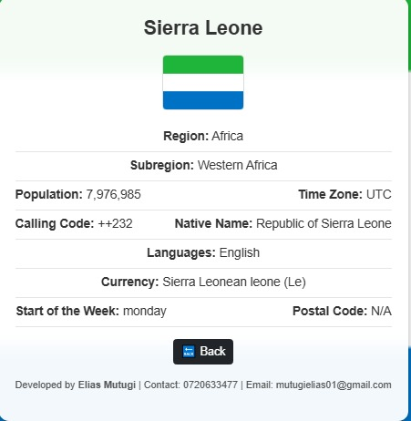

<p align="center">
  <a href="https://laravel.com" target="_blank">
    
  </a>
</p>

<p align="center">
  <a href="https://github.com/eliastush/world-countries-list/actions">
    
  </a>
  <a href="https://packagist.org/packages/world-countries-list">
    
  </a>
  <a href="https://packagist.org/packages/world-countries-list">
    
  </a>
  <a href="https://packagist.org/packages/world-countries-list">
    
  </a>
</p>

---

# World Countries List

A Laravel-based web application that provides a comprehensive list of countries, including details such as country names, capitals, currencies, population, and more.

This project is designed for easy access to country information through an API or user-friendly interface.

---

## Features

- Fetches data for all countries
- Displays country details (name, capital, region, currency, etc.)
- Search functionality to find a specific country
- API integration for external applications
- Responsive and user-friendly UI
- Built using Laravel for fast and scalable performance

---

## Laravel Advantages

- Elegant and expressive syntax
- Built-in authentication and authorization
- Robust routing system
- Powerful ORM (Eloquent) for database interactions
- Efficient queue system for background jobs
- Secure and scalable framework
- Extensive documentation and active community support

---

## Installation & Setup

### Clone the Repository

```sh
git clone https://github.com/eliastush/world-countries-list.git
cd world-countries-list
```

### Install Dependencies

```sh
composer install
npm install
```

### Set Up Environment Variables

Copy the example `.env` file and configure it:

```sh
cp .env.example .env
```

Update your `.env` file with database details.

### Generate Application Key

```sh
php artisan key:generate
```

### Run Database Migrations

```sh
php artisan migrate --seed
```

### Serve the Application

```sh
php artisan serve
```

The project should now be accessible at [http://127.0.0.1:8000](http://127.0.0.1:8000).

---

## Screenshots

Here are some previews of the application:

| Home Page | Country List |
|-----------|-------------|
|  |  |

| Kenya Details | kenya details | API Response |
|----------------|---------------|--------------|
|  |  |  | 

| Uganda details |
|-----------|
|  |

---

## API Endpoints

| Method | Endpoint | Description |
|--------|---------|------------|
| `GET` | `/api/countries` | Get a list of all countries |
| `GET` | `/api/countries/{code}` | Get details of a specific country |
| `GET` | `/api/regions` | Get a list of regions |

---

## Technologies Used

- Laravel – PHP Framework
- MySQL – Database
- Bootstrap – UI Styling
- Axios – API Requests
- Vue.js (Optional) – Frontend interactivity

---

## Contributing

Contributions are welcome! To contribute:

1. Fork the repository.
2. Create a new branch (`git checkout -b feature-branch`).
3. Make your changes.
4. Commit and push (`git commit -m "Added new feature"`).
5. Open a pull request.

---

## Security Vulnerabilities

If you find a security issue, please report it to [mutugielias01@gmail.com](mailto:mutugielias01@gmail.com) instead of posting it publicly.

---

## License

This project is open-source and available under the [MIT License](https://opensource.org/licenses/MIT).

---

## Contact

For any questions or suggestions, feel free to reach out:

Email: [mutugielias01@gmail.com](mailto:mutugielias01@gmail.com)  
Portfolio: [eliasmutugi's portfolio](https://sites.google.com/view/eliasmutugi/)

---

Enjoy using the World Countries List!
